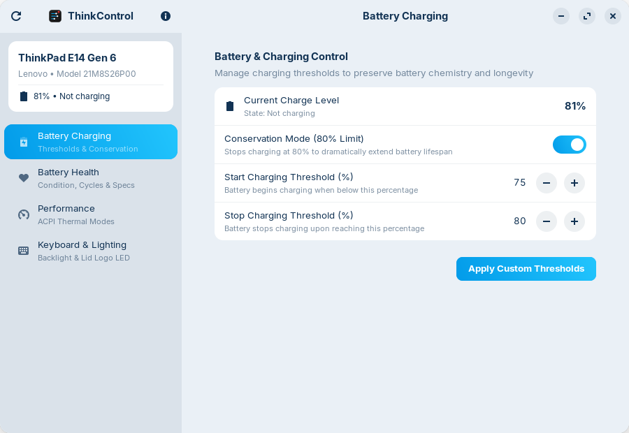

<div align="center">

# ThinkControl
### Lenovo Vantage Alternative for Linux (ThinkPad)

[](https://zorin.com/os/)
[](https://gnome.pages.gitlab.gnome.org/libadwaita/)
[](https://www.python.org/)
[](https://www.gnu.org/licenses/gpl-3.0)

**ThinkControl** is an elegant, native Linux desktop application that brings essential Lenovo Vantage hardware controls and battery diagnostics to Lenovo ThinkPad laptops running **Zorin OS 18** and modern GNOME/Linux distributions.

---



</div>

---

## 🌟 Key Features

| Feature | Description | Mechanism |
| :--- | :--- | :--- |
| **Battery Conservation Mode** | Protects battery health from degradation by capping charge at 80%. | `charge_control_end_threshold` |
| **Custom Dual Thresholds** | Fully configurable start and stop charge percentages (e.g., start at 40%, stop at 80%). | ThinkPad ACPI Battery sysfs |
| **Battery Health Diagnostics** | Displays precise battery health percentage with available Wh vs factory design Wh. | ACPI Energy telemetry ratio |
| **Cycle Count Tracker** | Tracks the total complete charge-discharge cycles recorded by battery firmware. | `/sys/class/power_supply/BAT0/cycle_count` |
| **Live Power Flow & Voltage** | Real-time monitoring of charging/discharging wattage rates and operating voltage. | `/sys/class/power_supply/BAT0/power_now` |
| **Hardware Metadata** | Displays manufacturer cell provider, chemistry, and battery model. | ACPI battery specification nodes |
| **ACPI Platform Profiles** | Switch between Lenovo firmware thermal modes: **Quiet / Power Saver**, **Balanced**, and **Extreme Performance**. | `/sys/firmware/acpi/platform_profile` |
| **Keyboard Backlight** | 3-stage keyboard illumination switch (Off, Low, High). | `/sys/class/leds/tpacpi::kbd_backlight/` |
| **Lid Logo Red Dot LED** | Toggle the iconic ThinkPad illuminated red dot LED on the display cover. | `/sys/class/leds/tpacpi::lid_logo_dot/` |
| **Live Thermal Monitor** | Monitors CPU thermal sensors continuously with automated background updates. | Linux thermal zone interface |

---

## 💻 System Requirements

- **Supported Hardware**: Lenovo ThinkPad laptops (e.g., E14, T14, X1 Carbon, L-series, P-series, Yoga) with the kernel module `thinkpad_acpi` active.
- **Operating System**: Zorin OS 18, Ubuntu 24.04 LTS, Debian 12+, or modern Linux with GNOME/Libadwaita.
- **Dependencies** *(pre-installed out-of-the-box on Zorin OS 18)*:
  - Python 3 (`>= 3.10`)
  - `python3-gi`, `gir1.2-gtk-4.0`, `gir1.2-adw-1`
  - `policykit-1` / `pkexec`

---

## 🚀 Installation Options

### Option 1: Install Official `.deb` Package (Recommended)

You can build and install the native Debian package that integrates seamlessly with **Zorin Software / GNOME Software Store**:

1. **Build the package:**
   ```bash
   cd /home/anggiyawan/www/ThinkControl
   ./build-deb.sh
   ```

2. **Install:**
   * **Via Graphical Installer**: Double-click `thinkcontrol_1.0.0_all.deb` in Files, then click **Install** in Software Store.
   * **Or via Terminal**:
     ```bash
     sudo dpkg -i thinkcontrol_1.0.0_all.deb
     ```

3. **Uninstall anytime via APT:**
   ```bash
   sudo apt remove thinkcontrol
   ```

---

### Option 2: Quick Script (User Space)

Install without root/sudo directly into your user environment:

```bash
cd /home/anggiyawan/www/ThinkControl
./install.sh
```

To remove:
```bash
./uninstall.sh
```

---

### Option 3: Manual Step-by-Step Installation

If you prefer setting up files manually:

1. **Install App Icons:**
   ```bash
   mkdir -p ~/.local/share/icons/hicolor/scalable/apps/
   mkdir -p ~/.local/share/icons/hicolor/128x128/apps/
   cp assets/com.lenovo.thinkcontrol.svg ~/.local/share/icons/hicolor/scalable/apps/
   cp assets/com.lenovo.thinkcontrol_128.png ~/.local/share/icons/hicolor/128x128/apps/com.lenovo.thinkcontrol.png
   ```

2. **Install AppStream Metainfo:**
   ```bash
   mkdir -p ~/.local/share/metainfo/
   cp assets/com.lenovo.thinkcontrol.metainfo.xml ~/.local/share/metainfo/
   ```

3. **Install CLI Executable:**
   ```bash
   mkdir -p ~/.local/bin/
   ln -sf /home/anggiyawan/www/ThinkControl/run.sh ~/.local/bin/thinkcontrol
   chmod +x ~/.local/bin/thinkcontrol
   ```

4. **Install Desktop Entry:**
   ```bash
   cat << 'EOF' > ~/.local/share/applications/com.lenovo.thinkcontrol.desktop
   [Desktop Entry]
   Name=ThinkControl
   GenericName=Lenovo Vantage Alternative
   Comment=Lenovo Vantage Hardware Control Center for Linux (ThinkPad)
   Exec=/home/anggiyawan/.local/bin/thinkcontrol
   Icon=com.lenovo.thinkcontrol
   Terminal=false
   Type=Application
   Categories=Settings;HardwareSettings;GTK;System;
   StartupNotify=true
   Keywords=lenovo;vantage;battery;thinkpad;charge;conservation;
   EOF
   chmod +x ~/.local/share/applications/com.lenovo.thinkcontrol.desktop
   update-desktop-database ~/.local/share/applications
   ```

---

## 🛠️ Running in Development Mode

Run the application directly from the source directory without installing:

```bash
cd /home/anggiyawan/www/ThinkControl
python3 main.py
```

---

## 🔒 Security & Privilege Model

Adjusting kernel hardware nodes (such as battery charge thresholds and ACPI performance profiles) requires root privileges. 

ThinkControl executes as an unprivileged user process and strictly delegates write commands via **PolicyKit (`pkexec`)**. The graphical interface never runs as root, ensuring your system remains secure and stable.

---

## 📄 License

This project is licensed under the **GNU General Public License v3.0 (GPL-3.0)**. See the [LICENSE](LICENSE) file for details.

---

## 👤 Author

Developed by **Anggiyawan** for the Linux ThinkPad community on Zorin OS.
